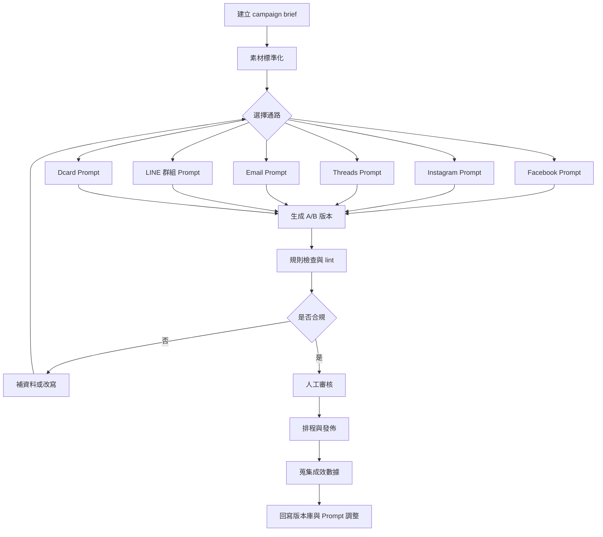

## 可重複運作流程

要把以上六組 Prompt 從「偶爾可用」變成「每次都能穩定交付」，最有效的方法不是一直改 Prompt 文案，而是把流程拆成：素材標準化、平台生成、規則檢查、人審、排程、回寫成效。這裡真正可複用的核心，不是某一句會爆的鉤子，而是「每一稿都經過同樣欄位、同樣版本碼、同樣 lint 檢查」。這種流程特別能同時處理 Meta 平台的推薦要求、Email 的寄送規範、LINE 的提醒邏輯，以及 Dcard 的商業限制。[\[31\]](https://creators.instagram.com/blog/instagram-recommendations-eligibility-tips-creators?locale=zh_TW)

### 素材準備清單

| 類別 | 必備欄位 | 說明 |
| :---- | :---- | :---- |
| 基本資訊 | 宣傳標的、目標對象、宣傳期間、活動日期地點 | 沒有這四項，就不應進入生成階段。 |
| 轉換資訊 | 報名／購買連結、價格／優惠、名額／截止日 | 沒有 CTA 相關資訊，AI 容易生成含糊或錯誤導流。 |
| 內容資訊 | 主要賣點、活動流程、講師／主辦資訊 | 用來決定文案主軸與說服順序。 |
| 視覺資訊 | 圖片說明、影片片段重點、封面方向 | 對 Instagram、Facebook、LINE 記事本特別重要。 |
| 合規資訊 | 品牌語調、禁用詞、法務備註、是否商業售票 | 對 Email、Dcard 最重要。 |
| 版本資訊 | campaignId、variantCode、owner、reviewer | 讓後續可追蹤。 |

### 

### 不同通路 Prompt 的呼叫方式

| 通路 | 建議觸發條件 | 輸出最小單位 | A/B 測試優先欄位 | 備註 |
| :---- | :---- | :---- | :---- | :---- |
| Facebook | 需要完整活動資訊與導流 | 1 則貼文 + 2 版鉤子 | 首行鉤子、CTA 句型、連結位置 | 適合活動資訊整合與名單導流。 |
| Instagram | 需要視覺呈現或 Reels | 1 則 caption \+ 鉤子 \+ 畫面指令 | 第一行鉤子、Hashtag 組合、封面字 | 連結不要放在 caption 當主策略。 |
| Threads | 需要話題擴散、回覆互動 | 1 則單貼或 2 則串文 | 開頭立場、結尾提問、topicTag | 優先測「問句」與「觀點句」差異。 |
| Email | 需要正式通知與轉換 | subject \+ preheader \+ body \+ CTA | Subject、Preheader、CTA 按鈕文字 | 需先確認退訂與寄送域名。 |
| LINE 群組 | 需要高開啟率提醒 | 聊天短訊息 \+ 記事本 | 首行時效句、是否加 emoji、是否附記事本 | 不建議把完整長文塞在聊天室。 |
| Dcard | 需要社群討論或官方廣告 | organic 或 official\_ad 二選一 | 標題角度、討論句、模式選擇 | 商業活動優先 official\_ad。 |

### 版本管理欄位

| 欄位 | 用途 | 範例 |
| :---- | :---- | :---- |
| campaignId | 同一活動主鍵 | ws\_ai\_copy\_202606 |
| platform | 通路 | instagram |
| variant | 版本碼 | A / B |
| hookType | 鉤子類型 | benefit\_first / problem\_first / question\_first |
| ctaStyle | CTA 類型 | direct\_signup / soft\_consideration / reply\_first |
| emojiLevel | 表情符號密度 | none / low / medium |
| imageAngle | 配圖角度 | scene / materials / speaker |
| sendSlot | 發送時段代號 | weekday\_noon / weekday\_evening |
| reviewer | 審核者 | amy.lin |
| status | 流程狀態 | draft / approved / scheduled / published |

### 

### 審核與合規檢查清單

| 檢查類型 | 檢查項目 | 適用通路 | 失敗時處理 | 來源 |
| :---- | :---- | :---- | :---- | :---- |
| 事實檢查 | 日期、時間、地點、價格、名額是否一致 | 全通路 | 一律退回重生，不得人工口改後直接發布 | 內部流程建議。 |
| 導流檢查 | Instagram 是否把主連結依賴在 caption、LINE 是否使用可疑短網址 | Instagram、LINE | 改成 Bio／記事本／完整網址 | 官方與實務。 [\[32\]](https://help.instagram.com/362497417173378) |
| 推薦資格 | 是否有明顯不原創、敏感或推薦不宜內容 | Instagram、Threads、Facebook | 降低觸及風險，先改稿再排程 | 官方。 [\[33\]](https://creators.instagram.com/blog/instagram-recommendations-eligibility-tips-creators?locale=zh_TW) |
| 寄送合規 | 是否有 unsubscribe、SPF／DKIM／DMARC、spam risk | Email | 未齊備不得寄送 | 官方。 [\[34\]](https://support.google.com/a/answer/81126?hl=en) |
| 商業規範 | 是否涉及售票、品牌推廣、加 LINE、外部商業導流 | Dcard | 切換 official\_ad 或改為討論導向版 | 官方。 [\[35\]](https://www.dcard.tw/f/announcement/p/234243656) |
| 打擾度 | 是否重複洗版、句子過長或像群發詐騙 | LINE 群組、Facebook | 改短、降低頻率、改記事本 | 官方與實務。 [\[36\]](https://help.line.me/line/smartphone/sp?contentId=20007005&lang=en) |

### 

### 排程與發佈建議

最穩的做法不是迷信「萬用最佳時段」，而是把排程策略綁到通路角色：

* Facebook：用於活動資訊完整曝光，可在宣傳初段與截止前各做一波，第二波文案應更聚焦名額與期限。

* Instagram：把 Feed／Reels 當成吸引力內容，限動或 Broadcast 再做補充提醒；若要追求推薦流量，優先測畫面鉤子而不是單純改 caption。

* Threads：用於拋出觀點、蒐集留言、做倒數提醒；不要只在最後一天才發。

* Email：以名單分層排程，至少測 two-step：首次通知與截止提醒；不用追求很多封，而是追求主旨與 preheader 的準確。

* LINE 群組：適合做「早鳥最後提醒」「今晚開課提醒」；官方原生不支援排程送出，所以若要自動化，要靠外部整合或人工 SOP，而不能假設 LINE 群組訊息本身能定時。[\[37\]](https://help.line.me/line/smartphone/sp?contentId=20007005&lang=en)

* Dcard：先確認板規、模式與合規性，再談時段。若是商業活動，自然看板的排程優先級應低於模式正確性。

## 程式規格文件

要把第二節與第三節真正交給工程師實作，關鍵不是把 Prompt 放進一個字串而已，而是先把資料模型定義清楚。建議系統以「單一 campaign brief \+ 平台規則引擎 \+ Prompt registry \+ lint validator \+ structured output」為核心。這樣做的最大好處是：新增平台、加語言、改規則都不需要重寫整個流程，只要擴充 registry 與 validator 即可。

### API／前端介面欄位定義

| 欄位名稱 | 型別 | 必填 | 範例值 | 說明 |
| :---- | :---- | ----: | :---- | :---- |
| campaignId | string | 是 | ws\_ai\_copy\_202606 | 活動主鍵。 |
| platform | enum | 是 | facebook | facebook / instagram / threads / email / line\_group / dcard。 |
| platformMode | enum | 否 | feed\_post | 例如 feed\_post / reels\_caption / thread\_single / email\_marketing / chat\_message / official\_ad。 |
| locale | string | 是 | zh-TW | 預設繁體中文。 |
| promotionTarget | string | 是 | AI 實戰線下工作坊｜把宣傳文案流程做成可重複模板 | 宣傳主題。 |
| targetAudience | string | 是 | 25–35 歲上班族 | 主目標族群。 |
| promotionStart | string(date) | 是 | 2026-06-01 | 宣傳開始日。 |
| promotionEnd | string(date) | 是 | 2026-06-15 | 宣傳結束日。 |
| eventDateTimeLocation | string | 是 | 2026-06-22 19:00–21:30，台北市大安區 | 活動時間與地點。 |
| keySellingPoints | string\[\] | 是 | \["6/15 前早鳥 8 折","附可重複使用模板"\] | 主要賣點列表。 |
| eventFlow | string\[\] | 否 | \["19:00 報到","19:30 AI 文案實作"\] | 流程或議程。 |
| registrationUrl | string(url) | 否 | https://example.com/workshop | 報名／購買頁。 |
| priceOffer | string | 否 | 原價 NT$3,600，早鳥 NT$2,880 | 價格與優惠。 |
| quotaDeadline | string | 否 | 限額 30 名，6/15 截止 | 名額與截止。 |
| brandVoice | string | 是 | 專業但不艱深，像懂行的同事 | 品牌語調。 |
| hasImageBrief | boolean | 是 | true | 是否有視覺素材說明。 |
| imageBrief | string\[\] | 否 | \["下班後工作坊現場","講義與筆電桌面"\] | 視覺描述。 |
| emojiPolicy | enum | 否 | low | none / low / medium。 |
| lengthCategory | enum | 否 | medium | short / medium / long。 |
| hashtagsLimit | integer | 否 | 5 | 平台可用標記數量上限。 |
| desiredCTA | string | 否 | 立即報名 | 希望 CTA 的方向。 |
| includeABVariants | boolean | 否 | true | 是否生成 A/B 版本。 |
| extraConstraints | string | 否 | 不要太浮誇 | 其他寫作限制。 |
| dcardMode | enum | 否 | official\_ad | organic\_community / official\_ad。 |
| isCommercialEvent | boolean | 否 | true | Dcard、Email 合規時特別有用。 |
| lineGroupType | enum | 否 | work\_group | close\_friends / alumni / work\_group / community。 |
| unsubscribeUrl | string(url) | 否 | https://example.com/unsubscribe | Email 行銷必填。 |
| owner | string | 否 | amy.lin | 建立者。 |
| reviewer | string | 否 | legal.tom | 審核者。 |

### 

### Prompt 模板變數標記方式

| 用法 | 語法 | 範例 |
| :---- | :---- | :---- |
| 單一字串 | {{fieldName}} | {{promotionTarget}} |
| 巢狀欄位 | {{group.field}} | {{campaign.targetAudience}} |
| 陣列逐項展開 | {{\#each arrayName}}...{{/each}} | {{\#each keySellingPoints}}- {{this}}{{/each}} |
| 條件式輸出 | {{\#if fieldName}}...{{/if}} | {{\#if imageBrief}}請參考圖片說明{{/if}} |
| 預設值 | {{fieldName | default:""}} | {{quotaDeadline | default:"未提供"}} |
| 日期格式化 | {{dateField | date:"YYYY-MM-DD"}} | {{promotionStart | date:"YYYY-MM-DD"}} |
| 陣列連接 | {{arrayName | join:"、"}} | {{keySellingPoints | join:"、"}} |

建議工程上把每個平台 Prompt 都做成 registry entry，例如：

* facebook.feed\_post.v1

* instagram.reels\_caption.v1

* threads.single\_post.v1

* email.marketing.v1

* line\_group.chat\_plus\_note.v1

* dcard.official\_ad.v1

這樣做的好處是之後要升級版本時，只要新增 v2，不用覆蓋舊稿，也比較容易追成效。

### 輸出 JSON 範例

{  
  "requestId": "req\_20260419\_001",  
  "metadata": {  
    "campaignId": "ws\_ai\_copy\_202606",  
    "platform": "instagram",  
    "platformMode": "reels\_caption",  
    "locale": "zh-TW",  
    "lengthCategory": "medium",  
    "variant": "A",  
    "generatedAt": "2026-04-19T10:20:00+08:00"  
  },  
  "inputSummary": {  
    "promotionTarget": "AI 實戰線下工作坊｜把宣傳文案流程做成可重複模板",  
    "targetAudience": "25–35 歲上班族",  
    "promotionPeriod": {  
      "start": "2026-06-01",  
      "end": "2026-06-15"  
    },  
    "eventDateTimeLocation": "2026-06-22 19:00–21:30，台北市大安區"  
  },  
  "output": {  
    "headline": "下班後，也能把 AI 用成你的工作工具。",  
    "opener": "這不是聽概念的課，而是直接把你的活動素材改成可用文案。",  
    "body": "給 25–35 歲上班族的台北實體工作坊，會從鉤子、賣點到 CTA 一次做完。6/15 前報名享早鳥 8 折，限額 30 名。",  
    "cta": "點個人檔案連結，先把早鳥席次留起來。",  
    "hashtags": \["\#AI工作坊", "\#上班族進修", "\#內容行銷"\],  
    "topicTag": null,  
    "linkPlacement": "bio",  
    "visualDirections": \[  
      "鏡頭一：下班後進教室的情境",  
      "鏡頭二：講義、筆電與便利貼桌面",  
      "封面字：下班後學會 AI 宣傳流程"  
    \],  
    "reelsExtras": {  
      "openingSubtitle": "AI 會寫，不代表你能直接拿來用。",  
      "coverText": "下班後學AI宣傳術"  
    }  
  },  
  "compliance": {  
    "status": "needs\_human\_review",  
    "checksPassed": \[  
      "date\_present",  
      "price\_present",  
      "cta\_present",  
      "hashtags\_within\_limit"  
    \],  
    "riskFlags": \[  
      "instagram\_caption\_url\_should\_not\_be\_primary\_link"  
    \],  
    "notes": \[  
      "主連結建議放在 Bio 或 action button。"  
    \]  
  },  
  "abTest": {  
    "variantId": "IG-A",  
    "variables": {  
      "hookType": "benefit\_first",  
      "emojiLevel": "low",  
      "hashtagSet": "conversion"  
    }  
  }  
}

### 驗證規則與錯誤處理

| 錯誤碼 | 觸發條件 | 處理方式 |
| :---- | :---- | :---- |
| MISSING\_REQUIRED\_FIELD | 缺 promotionTarget、targetAudience、promotionStart、promotionEnd、brandVoice 任一 | 直接拒絕生成，前端高亮缺漏欄位。 |
| INVALID\_DATE\_RANGE | promotionEnd \< promotionStart | 阻擋送出。 |
| INVALID\_PLATFORM\_MODE | platformMode 不屬於平台允許值 | 自動回退到平台預設 mode，並警告。 |
| IG\_HASHTAG\_LIMIT\_EXCEEDED | Instagram hashtags.length \> 5 | 自動截到 5 個並產生 warning。 |
| THREADS\_TOPIC\_LIMIT\_EXCEEDED | Threads topicTag 超過 1 個 | 只保留第一個並警告。 |
| EMAIL\_UNSUBSCRIBE\_REQUIRED | platform=email 且缺 unsubscribeUrl | 阻擋送出。 |
| EMAIL\_AUTH\_REQUIRED | platform=email 且系統標記為 marketing 模式但寄送域名未驗證 | 阻擋排程，只允許存草稿。 |
| LINE\_NATIVE\_SCHEDULE\_UNSUPPORTED | platform=line\_group 且 user 要求原生定時聊天訊息 | 顯示警告，要求改人工排程或外部整合。 |
| DCARD\_COMMERCIAL\_RISK | platform=dcard、dcardMode=organic\_community 且 isCommercialEvent=true | 改生風險警示，不可直接輸出導購版。 |
| OUTPUT\_TOO\_LONG | 生成結果超過平台建議上限 | 自動要求模型重寫一次。 |
| URL\_POLICY\_WARNING | Instagram 以 caption URL 為主 CTA；LINE 使用可疑短網址 | 允許草稿，但不允許發布。 |

### 

### 平台規則映射建議

| 規則鍵 | 規則內容 | 套用平台 | 來源 |
| :---- | :---- | :---- | :---- |
| facebook.avoid\_engagement\_bait | 禁止「留言+1」「分享抽獎」等互動誘餌式句型 | Facebook | 官方。 [\[38\]](https://about.fb.com/news/2017/12/news-feed-fyi-fighting-engagement-bait-on-facebook/) |
| instagram.max\_hashtags \= 5 | 貼文最多 5 個 Hashtag | Instagram | 官方。 [\[39\]](https://help.instagram.com/351460621611097?utm_source=chatgpt.com) |
| instagram.search\_keywords\_in\_caption \= true | 關鍵字與 Hashtag 放在 caption，不放 comments | Instagram | 官方。 [\[40\]](https://creators.instagram.com/blog/instagram-recommendations-eligibility-tips-creators?locale=zh_TW) |
| threads.max\_chars \= 500 | 單則上限 500 字，超過進串文 | Threads | 官方。 [\[41\]](https://help.instagram.com/1217144552251333?utm_source=chatgpt.com) |
| threads.max\_topic\_tags \= 1 | 每貼最多 1 個 topic tag | Threads | 官方 Help 搜尋片段。 [\[42\]](https://help.instagram.com/search/?helpref=search&query=google%E6%B4%97%E8%A9%95%E8%AB%96-ZY-104%E5%B1%A5%E6%AD%B7%E5%88%B7%E9%A0%BB%E7%A4%BA%E7%AF%84975) |
| email.unsubscribe\_required \= true | 行銷信件需退訂 | Email | 官方。 [\[43\]](https://senders.yahooinc.com/best-practices/) |
| email.video\_embed\_disallowed \= true | 影片改縮圖外連，不做原生嵌入 | Email | 官方。 [\[44\]](https://mailchimp.com/help/add-video-to-an-email/) |
| line\_group.native\_schedule \= false | 群組聊天不支援原生排程送出 | LINE 群組 | 官方。 [\[37\]](https://help.line.me/line/smartphone/sp?contentId=20007005&lang=en) |
| dcard.organic\_commercial\_block \= true | 自然社群模式禁止直接商業導流 | Dcard | 官方。 [\[35\]](https://www.dcard.tw/f/announcement/p/234243656) |
| dcard.official\_ad.copy\_spec \= 18/50/5 | 官方廣告欄位上限 | Dcard | 官方。 [\[45\]](https://about.dcard.tw/business/dcard-ads/forum) |

### 

### 可擴充性建議

系統若要擴充到新平台或新語言，建議不要把「Prompt 本文」寫死在應用邏輯內，而是採以下做法：

首先，把平台抽象成 platform profile。每個 profile 只需要定義幾個核心屬性：maxLength、ctaPolicy、linkPolicy、tagPolicy、reviewPolicy、requiredFields。如此一來，新增例如 LinkedIn、短影音腳本、官方帳號推播，都只是在 registry 多加一筆。

其次，把語言抽象成 locale pack。平台規則不變，但輸出語氣、日期格式、標點偏好、敬語層級會因語言不同而不同。這樣未來新增英文、日文時，不需複製整份 Prompt，只要切換語言包與少量規則。

最後，把成效回寫做成閉環：每一版出稿後，都把 hookType、ctaStyle、emojiLevel、sendSlot 與實際表現綁在一起，下一輪生成時優先抽到此前表現較好的 setting。真正讓 AI 文案流程變強的，不是一次把 Prompt 寫到完美，而是讓生成、審核、發布、成效這四個環節進入可學習的循環。

---

[\[1\]](http://%5b1%5d) https://mic.iii.org.tw/news.aspx?id=744

[https://mic.iii.org.tw/news.aspx?id=744](https://mic.iii.org.tw/news.aspx?id=744)

[\[2\]](https://creators.instagram.com/blog/instagram-recommendations-eligibility-tips-creators?locale=zh_TW) [\[4\]](https://creators.instagram.com/blog/instagram-recommendations-eligibility-tips-creators?locale=zh_TW) [\[5\]](https://creators.instagram.com/blog/instagram-recommendations-eligibility-tips-creators?locale=zh_TW) [\[13\]](https://creators.instagram.com/blog/instagram-recommendations-eligibility-tips-creators?locale=zh_TW) [\[20\]](https://creators.instagram.com/blog/instagram-recommendations-eligibility-tips-creators?locale=zh_TW) [\[27\]](https://creators.instagram.com/blog/instagram-recommendations-eligibility-tips-creators?locale=zh_TW) [\[31\]](https://creators.instagram.com/blog/instagram-recommendations-eligibility-tips-creators?locale=zh_TW) [\[33\]](https://creators.instagram.com/blog/instagram-recommendations-eligibility-tips-creators?locale=zh_TW) [\[40\]](https://creators.instagram.com/blog/instagram-recommendations-eligibility-tips-creators?locale=zh_TW) https://creators.instagram.com/blog/instagram-recommendations-eligibility-tips-creators?locale=zh\_TW

[https://creators.instagram.com/blog/instagram-recommendations-eligibility-tips-creators?locale=zh\_TW](https://creators.instagram.com/blog/instagram-recommendations-eligibility-tips-creators?locale=zh_TW)

[\[3\]](https://www.dcard.tw/f/announcement/p/234243656) [\[17\]](https://www.dcard.tw/f/announcement/p/234243656) [\[26\]](https://www.dcard.tw/f/announcement/p/234243656) [\[35\]](https://www.dcard.tw/f/announcement/p/234243656) https://www.dcard.tw/f/announcement/p/234243656

[https://www.dcard.tw/f/announcement/p/234243656](https://www.dcard.tw/f/announcement/p/234243656)

[\[6\]](https://www.facebook.com/help/1137641279683518) [\[19\]](https://www.facebook.com/help/1137641279683518) https://www.facebook.com/help/1137641279683518

[https://www.facebook.com/help/1137641279683518](https://www.facebook.com/help/1137641279683518)

[\[7\]](https://help.instagram.com/269314186824048/?utm_source=chatgpt.com) Share a post with multiple photos or videos on Instagram

[https://help.instagram.com/269314186824048/?utm\_source=chatgpt.com](https://help.instagram.com/269314186824048/?utm_source=chatgpt.com)

[\[8\]](https://help.instagram.com/1217144552251333?utm_source=chatgpt.com) [\[21\]](https://help.instagram.com/1217144552251333?utm_source=chatgpt.com) [\[28\]](https://help.instagram.com/1217144552251333?utm_source=chatgpt.com) [\[41\]](https://help.instagram.com/1217144552251333?utm_source=chatgpt.com) Start a new thread on Threads

[https://help.instagram.com/1217144552251333?utm\_source=chatgpt.com](https://help.instagram.com/1217144552251333?utm_source=chatgpt.com)

[\[9\]](https://mailchimp.com/help/best-practices-for-email-subject-lines/) [\[15\]](https://mailchimp.com/help/best-practices-for-email-subject-lines/) https://mailchimp.com/help/best-practices-for-email-subject-lines/

[https://mailchimp.com/help/best-practices-for-email-subject-lines/](https://mailchimp.com/help/best-practices-for-email-subject-lines/)

[\[10\]](https://help.line.me/line/smartphone/sp?contentId=20007005&lang=en) [\[16\]](https://help.line.me/line/smartphone/sp?contentId=20007005&lang=en) [\[23\]](https://help.line.me/line/smartphone/sp?contentId=20007005&lang=en) [\[25\]](https://help.line.me/line/smartphone/sp?contentId=20007005&lang=en) [\[30\]](https://help.line.me/line/smartphone/sp?contentId=20007005&lang=en) [\[36\]](https://help.line.me/line/smartphone/sp?contentId=20007005&lang=en) [\[37\]](https://help.line.me/line/smartphone/sp?contentId=20007005&lang=en) https://help.line.me/line/smartphone/sp?contentId=20007005\&lang=en

[https://help.line.me/line/smartphone/sp?contentId=20007005\&lang=en](https://help.line.me/line/smartphone/sp?contentId=20007005&lang=en)

[\[11\]](https://support.dcard.in/hc/zh-tw/articles/7424229042191-%E5%A6%82%E4%BD%95%E7%99%BC%E8%A1%A8%E6%96%87%E7%AB%A0%E5%91%A2-%E5%8F%AF%E4%BB%A5%E5%84%B2%E5%AD%98%E6%88%90%E8%8D%89%E7%A8%BF%E5%97%8E) https://support.dcard.in/hc/zh-tw/articles/7424229042191-%E5%A6%82%E4%BD%95%E7%99%BC%E8%A1%A8%E6%96%87%E7%AB%A0%E5%91%A2-%E5%8F%AF%E4%BB%A5%E5%84%B2%E5%AD%98%E6%88%90%E8%8D%89%E7%A8%BF%E5%97%8E

[https://support.dcard.in/hc/zh-tw/articles/7424229042191-%E5%A6%82%E4%BD%95%E7%99%BC%E8%A1%A8%E6%96%87%E7%AB%A0%E5%91%A2-%E5%8F%AF%E4%BB%A5%E5%84%B2%E5%AD%98%E6%88%90%E8%8D%89%E7%A8%BF%E5%97%8E](https://support.dcard.in/hc/zh-tw/articles/7424229042191-%E5%A6%82%E4%BD%95%E7%99%BC%E8%A1%A8%E6%96%87%E7%AB%A0%E5%91%A2-%E5%8F%AF%E4%BB%A5%E5%84%B2%E5%AD%98%E6%88%90%E8%8D%89%E7%A8%BF%E5%97%8E)

[\[12\]](https://about.fb.com/news/2017/12/news-feed-fyi-fighting-engagement-bait-on-facebook/) [\[38\]](https://about.fb.com/news/2017/12/news-feed-fyi-fighting-engagement-bait-on-facebook/) https://about.fb.com/news/2017/12/news-feed-fyi-fighting-engagement-bait-on-facebook/

[https://about.fb.com/news/2017/12/news-feed-fyi-fighting-engagement-bait-on-facebook/](https://about.fb.com/news/2017/12/news-feed-fyi-fighting-engagement-bait-on-facebook/)

[\[14\]](https://about.fb.com/news/2025/03/new-threads-features-more-personalized-experience-you-control/) https://about.fb.com/news/2025/03/new-threads-features-more-personalized-experience-you-control/

[https://about.fb.com/news/2025/03/new-threads-features-more-personalized-experience-you-control/](https://about.fb.com/news/2025/03/new-threads-features-more-personalized-experience-you-control/)

[\[18\]](https://help.instagram.com/362497417173378) [\[32\]](https://help.instagram.com/362497417173378) https://help.instagram.com/362497417173378

[https://help.instagram.com/362497417173378](https://help.instagram.com/362497417173378)

[\[22\]](https://help.instagram.com/search/?helpref=search&query=google%E6%B4%97%E8%A9%95%E8%AB%96-ZY-104%E5%B1%A5%E6%AD%B7%E5%88%B7%E9%A0%BB%E7%A4%BA%E7%AF%84975) [\[42\]](https://help.instagram.com/search/?helpref=search&query=google%E6%B4%97%E8%A9%95%E8%AB%96-ZY-104%E5%B1%A5%E6%AD%B7%E5%88%B7%E9%A0%BB%E7%A4%BA%E7%AF%84975) https://help.instagram.com/search/?helpref=search\&query=google%E6%B4%97%E8%A9%95%E8%AB%96-ZY-104%E5%B1%A5%E6%AD%B7%E5%88%B7%E9%A0%BB%E7%A4%BA%E7%AF%84975

[https://help.instagram.com/search/?helpref=search\&query=google%E6%B4%97%E8%A9%95%E8%AB%96-ZY-104%E5%B1%A5%E6%AD%B7%E5%88%B7%E9%A0%BB%E7%A4%BA%E7%AF%84975](https://help.instagram.com/search/?helpref=search&query=google%E6%B4%97%E8%A9%95%E8%AB%96-ZY-104%E5%B1%A5%E6%AD%B7%E5%88%B7%E9%A0%BB%E7%A4%BA%E7%AF%84975)

[\[24\]](https://support.google.com/a/answer/81126?hl=en) [\[29\]](https://support.google.com/a/answer/81126?hl=en) [\[34\]](https://support.google.com/a/answer/81126?hl=en) https://support.google.com/a/answer/81126?hl=en

[https://support.google.com/a/answer/81126?hl=en](https://support.google.com/a/answer/81126?hl=en)

[\[39\]](https://help.instagram.com/351460621611097?utm_source=chatgpt.com) Use hashtags on Instagram

[https://help.instagram.com/351460621611097?utm\_source=chatgpt.com](https://help.instagram.com/351460621611097?utm_source=chatgpt.com)

[\[43\]](https://senders.yahooinc.com/best-practices/) https://senders.yahooinc.com/best-practices/

[https://senders.yahooinc.com/best-practices/](https://senders.yahooinc.com/best-practices/)

[\[44\]](https://mailchimp.com/help/add-video-to-an-email/) https://mailchimp.com/help/add-video-to-an-email/

[https://mailchimp.com/help/add-video-to-an-email/](https://mailchimp.com/help/add-video-to-an-email/)

[\[45\]](https://about.dcard.tw/business/dcard-ads/forum) https://about.dcard.tw/business/dcard-ads/forum

[https://about.dcard.tw/business/dcard-ads/forum](https://about.dcard.tw/business/dcard-ads/forum)
